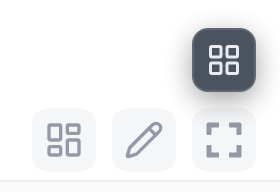
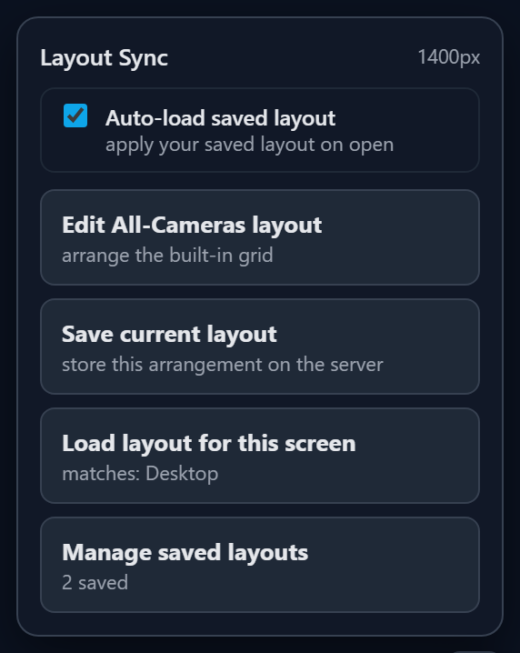
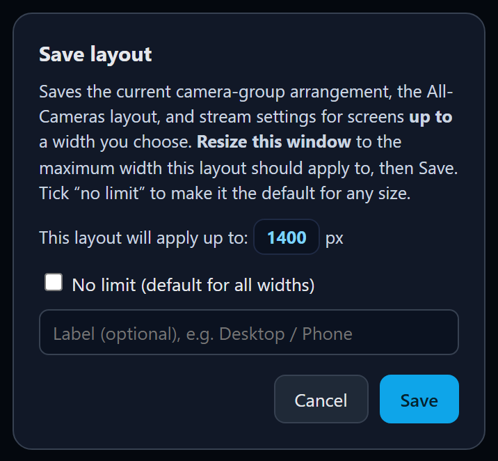
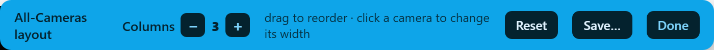

# frigate-layout-sync

Save, restore and **sync [Frigate](https://frigate.video) camera-group dashboard layouts across all your devices**, with **responsive, per-width breakpoints** so a phone, a tablet and a desktop can each load the arrangement that fits its screen.

Frigate stores each camera group's draggable tile layout (and per-camera stream settings like compatibility mode) **per-browser, in IndexedDB**. Every new device or browser starts from scratch, and there is no way to keep a different layout for a phone versus a wall display. This tool fixes both: one click saves the current layout to a small server, another click loads the right one back, on any device. It also gives Frigate's built-in **All Cameras** view a custom, draggable layout, which Frigate itself does not support.

> Community answer to Frigate issue [#23462](https://github.com/blakeblackshear/frigate/issues/23462) (*"Add import/export for camera group layouts"*), which is on Frigate's roadmap but planned as per-device file export only. This tool adds true **server-side, cross-device, responsive** sync today.

<p align="center">
  
  &nbsp;&nbsp;
  
  &nbsp;&nbsp;
  
</p>
<p align="center"><sub>The <b>Layouts</b> button drops in with Frigate's own controls (above the fullscreen button) · the panel · the save dialog</sub></p>

---

## How it works — no reverse proxy

Frigate has no frontend plugin API, so this runs as a tiny companion container that makes **Frigate's own nginx** inject one button. **Frigate stays the front door on its normal port** — it serves all your assets, the live-view websockets and video exactly as before. The companion only does two small things:

```
   your browser ───► Frigate (nginx, port 8971, unchanged) ──► cameras / recordings
   (any device)          │  injects <script> via sub_filter
                         /__layoutsync/*  ───► frigate-layout-sync companion ──► layouts.yaml
```

1. The companion adds two lines to Frigate's nginx config: a `sub_filter` that injects one `<script>` into the dashboard, and a `location /__layoutsync/` that routes just that path to the companion. It applies them by editing the config **inside the running Frigate container** (over the Docker socket), validating with `nginx -t`, then reloading.
2. It **re-applies automatically whenever Frigate (re)starts** — so a Frigate upgrade, which recreates the container from a fresh image and wipes the edit, *self-heals* with no manual step.
3. The companion serves the injected client (`/__layoutsync/inject.js`) and a tiny layout API (`/__layoutsync/api/*`), storing profiles as YAML.

Because the button runs **inside** the real Frigate page (same origin, same port) it reads and writes Frigate's own IndexedDB layout entries directly, and your existing dragged layouts always carry over. Because the layouts live on the **server**, every device that opens Frigate shares them — including phones — with nothing to install per-device. If the companion stops, you simply lose the extra button; if Frigate ever can't reach it, that one `location` just 502s while the rest of Frigate is unaffected.

---

## Install

### Docker Compose (recommended)

Add the companion next to your existing Frigate service and put both on a shared
network so Frigate's nginx can reach it. **You do not move Frigate's port or touch
its config** — the companion does the nginx wiring itself.

```yaml
services:
  frigate:
    image: ghcr.io/blakeblackshear/frigate:stable
    container_name: frigate            # must match FRIGATE_CONTAINER below
    ports: ["8971:8971"]               # Frigate keeps its normal port
    networks: [layoutsync]             # <-- add this line
    # ...your usual frigate config...

  frigate-layout-sync:
    build: .                           # or image: ghcr.io/mayerwin/frigate-layout-sync:latest
    container_name: frigate-layout-sync
    restart: unless-stopped
    environment:
      FRIGATE_CONTAINER: frigate
      LAYOUTSYNC_UPSTREAM: frigate-layout-sync:3000
    volumes:
      - /var/run/docker.sock:/var/run/docker.sock          # to wire + reload Frigate's nginx
      - ./frigate/config/layout-sync:/app/data             # layouts.yaml (inside /config = backed up)
    networks: [layoutsync]
    depends_on: [frigate]

networks:
  layoutsync:
```

```bash
docker compose up -d --build
```

Open Frigate at its **usual** `https://<frigate-host>:8971`. A small **Layouts** icon
appears bottom-right. (First run waits for Frigate to be up, then injects + reloads nginx.)

> **Why the Docker socket?** It's how the companion keeps the one-line nginx
> injection in place and reloads nginx after a Frigate upgrade, with zero manual
> steps. It only ever execs `nginx` in your Frigate container. If you'd rather not
> mount it, use the manual mode below.

### Manual mode (no Docker socket)

Set `NGINX_AUTOCONFIG=false` and wire Frigate's nginx yourself. Frigate
[supports bind-mounting a custom `nginx.conf`](https://docs.frigate.video/configuration/advanced/).
Add, **inside `location / { … }`**:

```nginx
sub_filter '</body>' '<script src=/__layoutsync/inject.js defer></script></body>';
```

The `src` is deliberately **unquoted**: Frigate's `location /` sets
`sub_filter_types text/css application/javascript`, so this `sub_filter` also runs
on JS bundles. A bundle containing `</body>` in a string (Frigate's ConfigEditor)
would get this tag spliced into that string, and a quoted `src` would terminate
the JS string (`SyntaxError`, blank page). Unquoted is valid HTML5 here.

and, **inside `server { … }`** (a sibling of `location /`):

```nginx
location /__layoutsync/ { proxy_pass http://frigate-layout-sync:3000; }
```

To generate a ready-to-mount file from your exact Frigate version:

```bash
docker run --rm ghcr.io/blakeblackshear/frigate:0.17.1 \
  cat /usr/local/nginx/conf/nginx.conf > nginx.conf
# then add the two snippets above and bind-mount it:
#   - ./nginx.conf:/usr/local/nginx/conf/nginx.conf
```

### Running more than one injecting companion

The companion edits Frigate's single `nginx.conf` cooperatively, so multiple
extensions can inject at once without clobbering each other. The convention is
documented in **[PROTOCOL.md](PROTOCOL.md)** (`src/nginx.js` is the reference
implementation) — follow it if you're building another Frigate companion.

### Configuration

| Env var | Default | Meaning |
|---|---|---|
| `FRIGATE_CONTAINER` | `frigate` | Name/id of your Frigate container (the companion execs `nginx` inside it). |
| `LAYOUTSYNC_UPSTREAM` | `frigate-layout-sync:3000` | How Frigate's nginx reaches the companion (must resolve on the shared network). |
| `PORT` | `3000` | Port the companion listens on (internal; Frigate's nginx proxies to it). |
| `DATA_DIR` | `./data` | Where `layouts.yaml` is written. Point it inside Frigate's `/config` to get backups. |
| `NGINX_RESOLVER` | `127.0.0.11` | Docker's embedded DNS, used by the injected `location` to resolve the companion lazily. |
| `NGINX_AUTOCONFIG` | `true` | Set `false` to manage Frigate's nginx yourself (manual mode above). |
| `FRIGATE_NGINX_CONF` | `/usr/local/nginx/conf/nginx.conf` | Path to Frigate's nginx.conf inside the container. |

---

## Usage

1. Open **`https://<frigate-host>:8971`** as normal and log in.
2. Arrange a camera **group** the way you want using Frigate's drag/resize editor, then click **Layouts → Save current layout**. Resize the window to the maximum width this layout should apply to (the dialog shows the live width), or tick **No limit** for the default, give it a label, and Save.
3. On a phone, tablet or another browser, it loads **automatically** (see below). You can also click **Layouts → Load layout for this screen** to force the best-fit layout for the current width.
4. **Layouts → Manage saved layouts** lists every saved breakpoint and lets you delete any.

Build responsive breakpoints by repeating step 2 at a few widths (for example one at `≤ 600 px` for phones, one at `≤ 1200 px` for tablets, and a no-limit default for desktop). You can configure them all from a single computer just by resizing the window.

### Auto-load (on by default)

By default the saved layout for the current screen width is **applied automatically when you open Frigate** — on every device, with nothing to click. A checkbox at the top of the **Layouts** panel, **"Auto-load saved layout"**, lets you turn this off per browser (then it only changes when you click *Load layout for this screen*).

- **Installing never loses your existing layout.** If nothing is saved yet, the tool *bootstraps* from whatever you currently have arranged in this browser — it saves that as your default and starts syncing it. Opening the extension only ever **adds** the sync capability; it never changes or discards your current arrangement.
- Auto-load is **idempotent**: it only re-applies (a quick reload) when the saved layout actually differs from what the browser already shows, so there's no flicker on every open and no reload loop. The **All Cameras** custom layout applies instantly with no reload.
- With auto-load on, **"Load layout for this screen"** is rarely needed — it's there to force a specific width's layout, or to pull the latest if you've turned auto-load off on that device.

### Custom layout for the built-in "All Cameras" view

Frigate makes only **named camera groups** draggable; its built-in **All Cameras** view is a fixed auto-grid you cannot rearrange. This tool adds that missing capability. Open the All Cameras view, then **Layouts → Edit All-Cameras layout**, and:

- **drag a camera** to reorder it,
- **click a camera** to cycle its width (how many columns it spans),
- set the **column count** from the toolbar.

<p align="center"></p>

Click **Save…** to store it like any other layout (responsive, per width). It is re-applied automatically on every device and survives refreshes. Frigate is not modified; the arrangement is layered on top of Frigate's own grid as CSS, keyed on each tile's camera name. (Drag uses pointer events, so it works with a mouse or touch.)

---

## What gets saved

The presentation entries Frigate keeps in IndexedDB (`keyval-store`/`keyval`):

- `` `<group>-draggable-layout` ``: the `react-grid-layout` tile arrangement per camera group (optionally suffixed `:<username>` when logged in).
- `streaming-settings`: per-camera stream choice, **compatibility mode**, audio, volume.
- `live-layout`, `autoLiveView`, `displayCameraNames`: dashboard preferences.

Plus the **All Cameras** layout (column count, camera order and per-camera width). Frigate has no place to store that, so this tool keeps it in the layout profile and re-applies it as CSS over Frigate's grid.

Camera group **membership and icons** are not touched; those live in Frigate's own `config.yaml`.

---

## Notes & limitations

- The button only changes the dashboard's *presentation*; it never alters Frigate's config, recordings, or detection.
- Frigate's draggable grid is a **desktop** feature; phones use a separate list/grid view. The responsive breakpoints are most useful across desktop and tablet widths, but the saved preferences (stream and compatibility settings) apply everywhere.
- Layout keys are saved verbatim, including the `:<username>` suffix. If you log into Frigate with the **same** account everywhere (the normal case) they match across devices.
- The companion edits only Frigate's *served HTML* and adds one `location`; it never touches recordings, detection or config. The change is fully reversible: `npm run nginx:remove` (or just stop the container and restart Frigate) restores a vanilla nginx.

## Testing

An end-to-end test drives a real browser against your Frigate (with the companion's
injection applied) and exercises the whole flow (login, injection, live-view
survival, save, load, responsive pick, delete). It uses throwaway IndexedDB keys, so
it never touches your real dragged layouts (it does reset this tool's own saved profiles).

```bash
npm install                          # includes the playwright devDependency
npx playwright install chromium
# FRIGATE_PROXY = your Frigate URL (the companion has injected the button there)
FRIGATE_PASSWORD=yourpass FRIGATE_PROXY=https://<frigate-host>:8971 npm test
```

## License

MIT © Erwin Mayer. Not affiliated with the Frigate project.
